Avant d'aller synthétiser ces informations sur mes [notes](/notes "le wiki d'id-libre.org"), je rédige un bref billet pour documenter ma méthode pour numériser un « vinyl » à l'aide du logiciel [Audacity](http://www.audacityteam.org/ "site officiel d'Audacity"). C'est d'ailleurs surtout mon utilisation de ce logiciel dont il est question ici, pas du de matériel, branchement ou de méthode de description des documents numérisés, même si il peut m'arriver d'en toucher un mot en passant.

Audacity n'est peut-être pas ton logiciel de prédilection, mais je pense qu'il compte parmi les meilleurs. Son interface n'est pas la plus limpide, mais on s'y fait très rapidement, ni la plus sophistiquée, mais c'est un logiciel de qualité, professionnel et, surtout, il est [libre](https://fr.wikipedia.org/wiki/Logiciel_libre "Article Wikipédia sur le logiciel libre"). Pour l'installation, il est dans les dépôts des distributions GNU/Linux qui se respectent, sinon, tu trouveras de quoi faire sur la page de [téléchargement](http://www.audacityteam.org/download/ "Page de téléchargement officielle d'Audacity") officielle du logicielle.   
À noter qu'on trouve, dans la documentation officielle, un [tutoriel de qualité en anglais](http://manual.audacityteam.org/man/sample_workflow_for_lp_digitization.html "Comment numériser un vinyle, en anglais, documentation officielle").

Une fois le logiciel installé et le branchement de la platine effectué, on est prêt. On peut lancer Audacity.

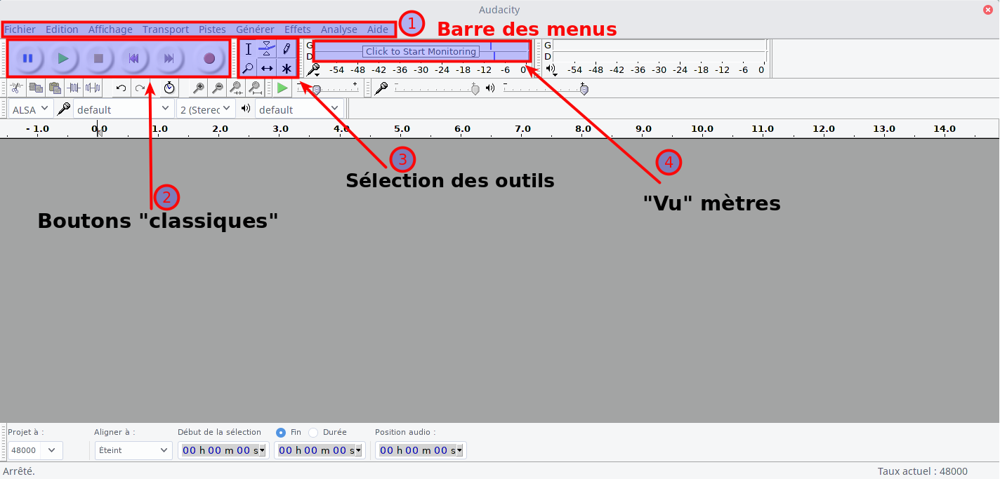

1. Les boutons classiques, pour mettre en pause, activer le mode enregistreur, stopper la lecture ou l'enregistrement...
2. Le sélecteur d'outils. J'en utilise parfois 3, le sélectionné par défaut pour positionner le « curseur », celui avec les deux flèches de côtés pour déplacer des blocs de sons, et le crayons si vraiment je dois agir sur le signal enregistré.
3. La zone où viendront se positionner les pistes de sons.
4. Le « vu » mètre, pour vérifier le volume du son.

Je commence en général par mettre activer l'enregistrement en mode pause, en cliquant d'abord sur le bouton pause, puis sur le bouton d'enregistrement. On peut vérifier la qualité du son, si le volume n'est pas trop faible ou trop fort, ou s'il n'y en a pas du tout dans le cas où on s'est trompé dans les branchements ou les réglages. 

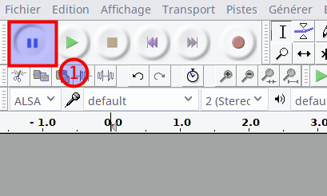

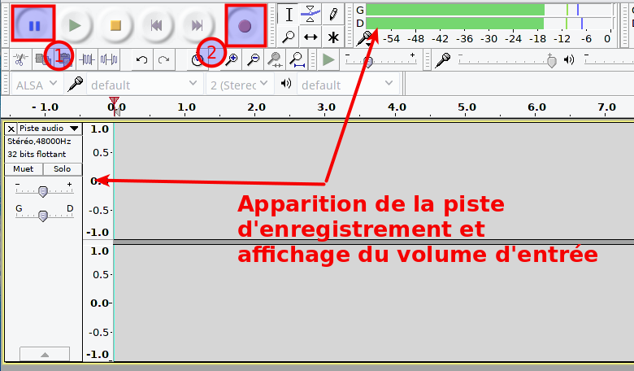

Après avoir réglé le volume comme désiré, vérifié que tout était ok, on peut cliquer sur le bouton pause, ou appuyer sur la touche p, pour activer l'enregistrement et lancer la platine. Et pendant l'écoute, il n'y a rien de spécial à faire.

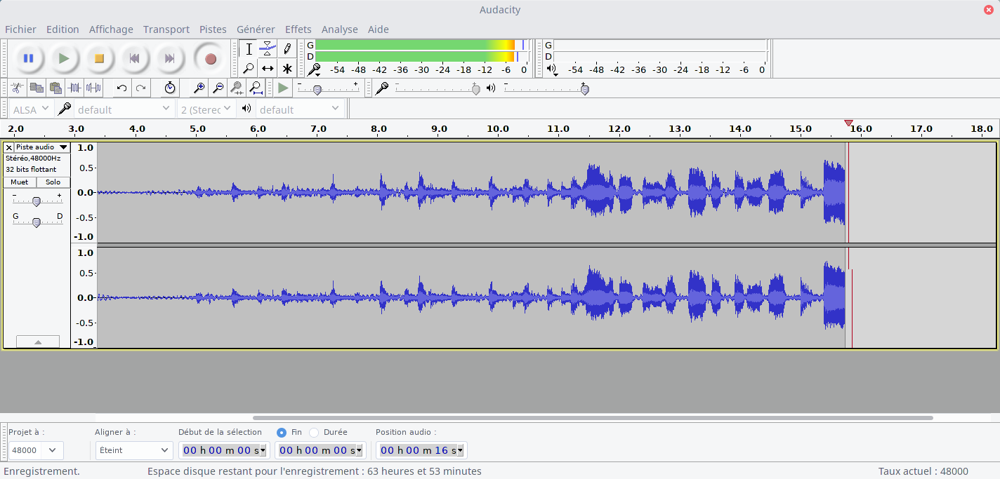

Lorsque j'arrive à la fin de la première face, je ne stoppe pas l'enregistrement, mais je le mets en pause. En effet, lorsque l'on stoppe l'enregistrement, et qu'ensuite on le relance, Audacity ouvre une deuxième piste de son, ce qui est assez logique, mais ce n'est pas ce qu'on désire faire. Si cela t'es arrivé par mégarde, il est possible de mettre la première piste en mode muet, et à la fin de l'enregistrement de réunir les deux pistes avec l'outil de déplacement des blocs de sons.

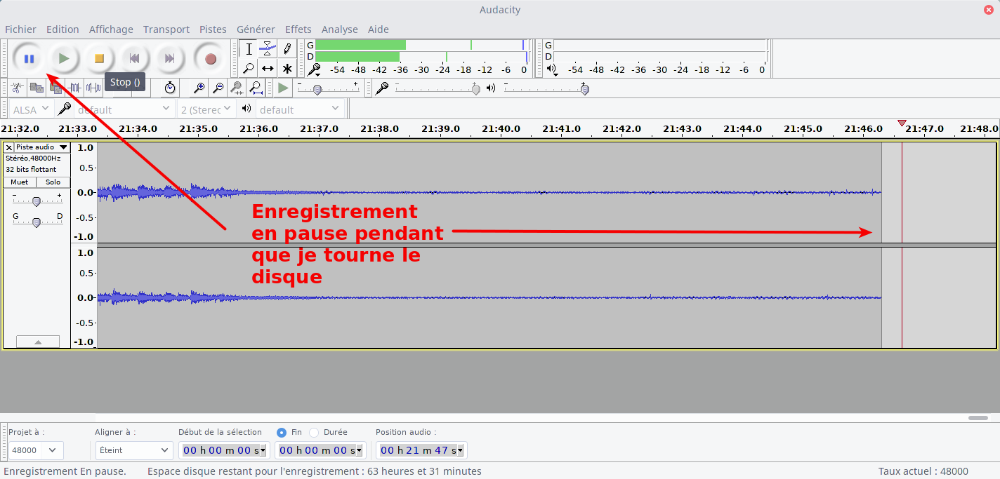

Donc, on met l'enregistrement en pause, soit avec le bouton pause soit avec la touche p, et on tourne le disque. Puis on relance l'enregistrement, avec le bouton pause ou la touche p, et on relance le disque. Et on répète l'opération autant de fois qu'on a de faces.

Arrivé au bout de l'enregistrement de toutes les faces, on peut stopper l'enregistrement. Et c'est un bon moment pour enregistrer le projet (fichier/enregistrer le projet). Pour ma part, je crée toujours un dossier spécifique pour chaque projet, parce qu'audacity crée un certain nombre de fichier, alors autant les réunir au même endroit.

Puis, j'affiche l'ensemble de la piste avec un CTRL+F, ce qui permet de voir quelques anomalies.

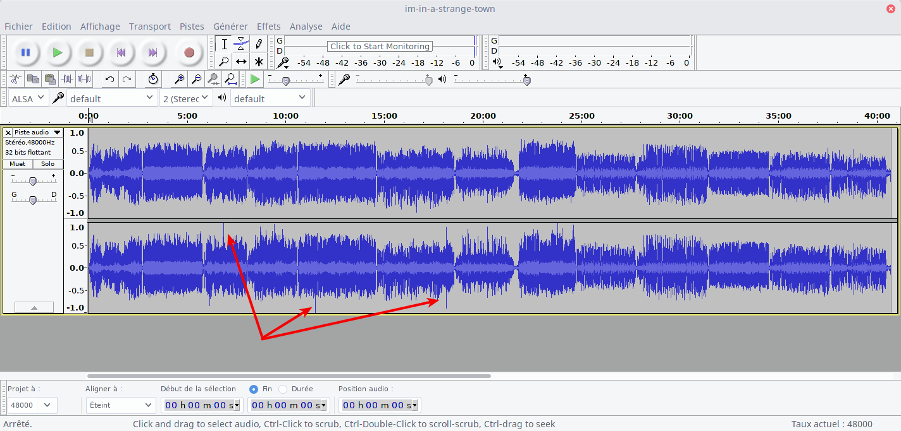

Avec mon outil de positionnement, l'outil sélectionné par défaut, je sélectionne la zone où il y a apparemment des clics importants, et je lance l'effet « Suppression des clics » (Effets/Suppression des clics), partout où nécessaire.

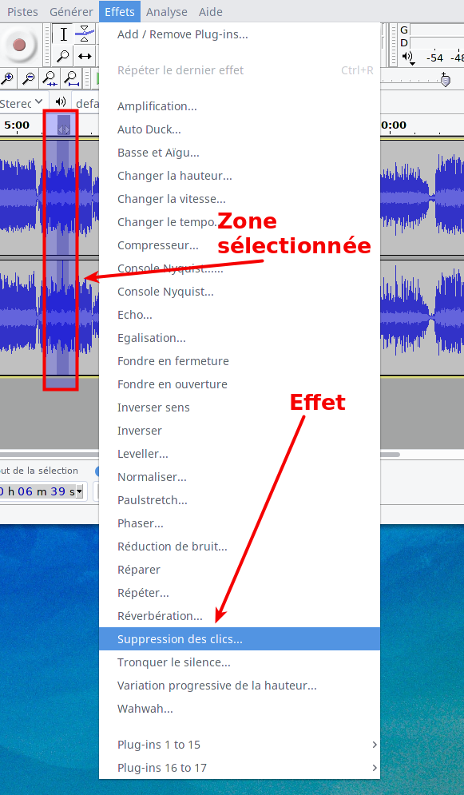

Il est possible de régler le seuil et le niveau pour améliorer les choses. Une fois cette partie terminée, je sélectionne le tout avec un CTRL+A et j'applique l'effet compresseur (Effet/Compresseur), une ou deux fois selon les cas. Ça permet notamment d'augmenter le volume sans saturer.

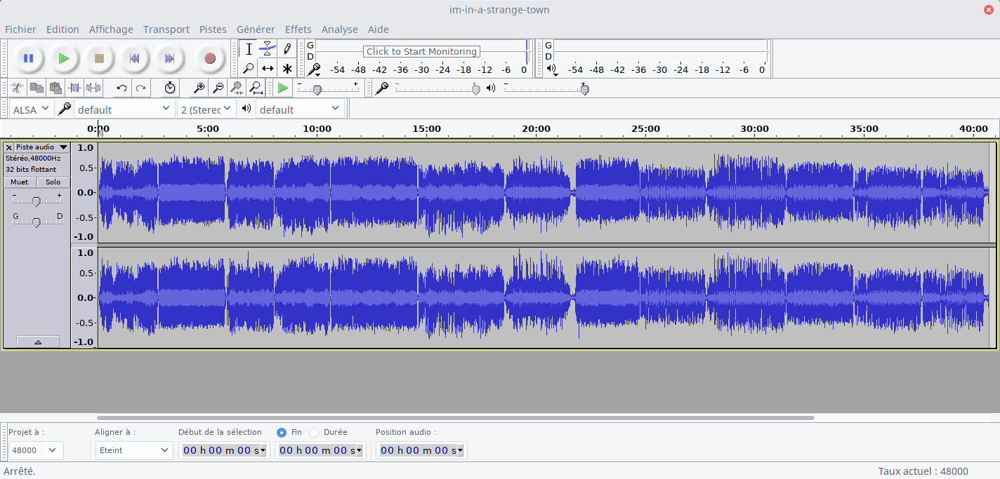

Et c'est maintenant que tout commence... Il s'agit de reconstituer les pistes. Il y a bien un outil d'identification des silences (Analyse/Silence finder), mais je ne le trouve que moyennement précis, et pour certains disques carrément inutiles. Donc je fais à la main. Pour cela, je me place tout au début de la piste avec le bouton retour en arrière (Saut au début, Home), et ensuite je joue avec les combinaisons CTRL+1 pour zoomer et CTRL+3 pour dézoomer, ainsi que la barre d'espace qui lance ou stoppe la lecture. Avec ces outils de repère le début d'une piste, et je place mon curseur où je veux créer un repère.

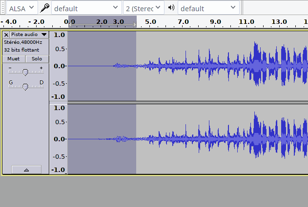

Dans la capture d'écran ci-dessus, je me suis placé tout au début, j'ai zoomé pour mieux voir, placé mon cuseur vers le début, lancé la lecture pour entendre où commence le morceau, arrêté la lecture, placé mon curseur un peu avant le début du son et sélectionné ce qu'il y avait avant pour l'effacer d'un backspace ou d'un delete. Ensuite, je fais un CTRL+b pour créer un repère, que je vais ensuite nommer.

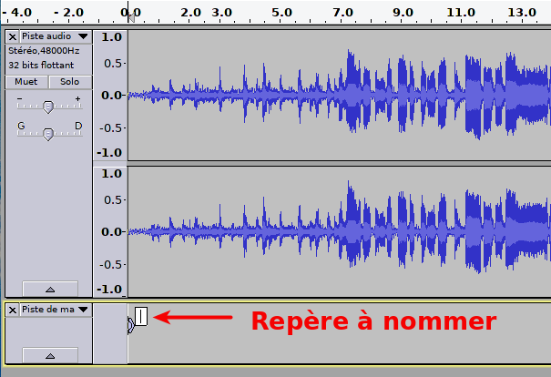

Je peux donc taper du texte, à savoir le nom de ma piste. Ci-dessous, le repère est renseigné. Les copier-coller sont possible, bien entendu. Ici, j'ai mis le numéro de la piste (face A, numéro 1), puis l'artiste, parce que c'est une compilation, et enfin le nom du morceau. Il va falloir éviter certains caractères, parce qu'audacity va ensuite nommer le fichier avec ce repère et n'apprécie pas les caractères interdits habituels. On pourra corriger ça ensuite.

Puis, avec le CTRL+3, je dézoome, repère le prochain silence (ou changement de piste sans silence, ça arrive), place mon curseur où je le désire et crée un nouveau repère avec CTRL+b, mais avant je fais un CTRL+i pour diviser la piste, histoire d'avoir un bloc par morceau.

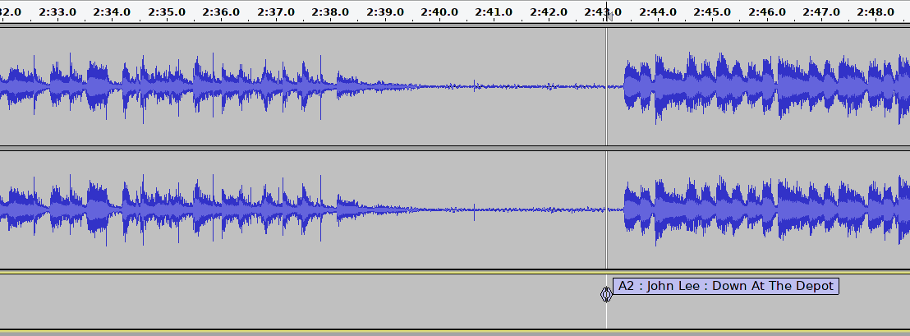

Et on recommence, autant de fois que nécessaire. Au changement de face de disque, on peut aussi supprimer du silence, bien entendu. Et si on se plante dans les repères, il y a un outil sous le menu Piste/Editer les marqueurs.. qui est bien pratique.

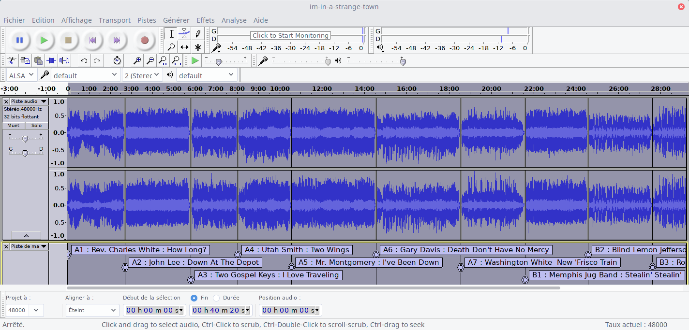

Une fois tous les marqueurs indiqués, on peut aller dans Fichier/Editer les metadata... et entrer les données utiles, au niveau de l'album. Pour les morceaux, ce sera fait automatiquement ensuite. Enfin, on peut aller sous Fichier/Export multiple... et sélectionner le type de format et la qualité désirée. On indique que l'on veut séparer en fichier selon les marqueurs et renommer le fichier avec la numérotation avant le nom de marqueur ou de piste. Enfin, au sommet de la fenêtre, on tape le répertoire cible que l'on peut ensuite créer avec le bouton idoine.

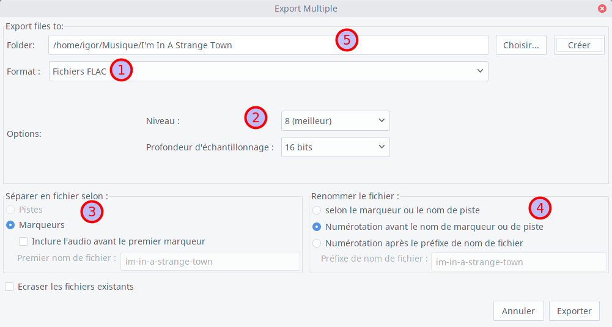

Ensuite on peut cliquer sur le bouton exporter. Audacity va présenter les données pour chaque piste qui sera créee. C'est l'occasion de faire quelques ajustements si nécessaire et de vérifier que tout est comme on le voulait. Une fois que tous les fichiers sont exportés, j'enregistre le projet. Pour ma part, je le conserve, mais chacun fait comme il le veut.

Ensuite, je nettoye encore les métadonnées avec un logiciels prévu pour cela, par exemple EasyTag ou MusicBrainz Picard, je calcul le tag du replaygain, j'ajoute le fichier de couverture, et c'est terminé !

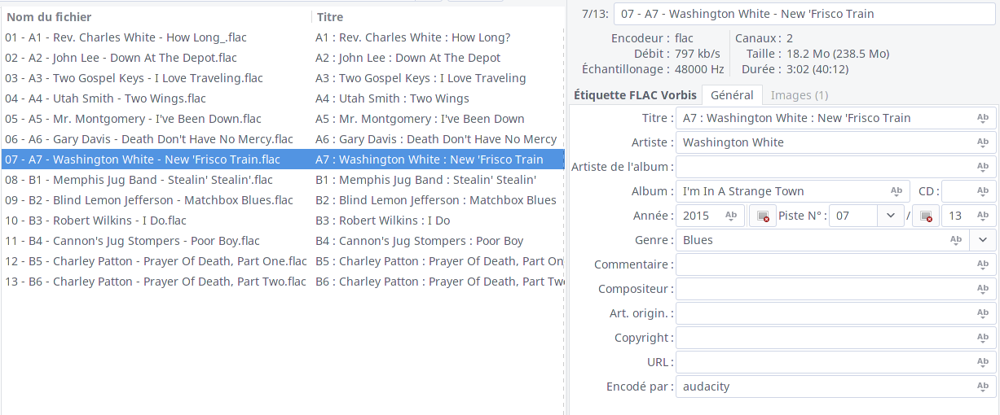

